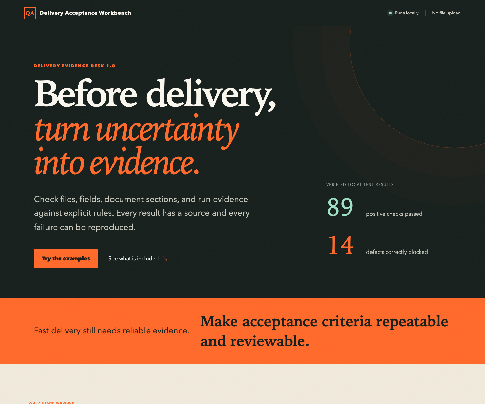

# Delivery Acceptance Workbench

Interactive preview for a local Python QA utility that checks delivery folders
against reusable JSON rules and generates traceable JSON and offline HTML
acceptance reports.

[Open the live demo](https://stomeonst.github.io/delivery-acceptance-workbench/)

## What the full package checks

* Required and empty files
* Required Markdown sections
* CSV columns and top-level JSON keys
* PNG, GIF, and JPEG dimensions
* Video codec, size, frame rate, pixel format, and duration with `ffprobe`
* Recursive SHA-256 hashes and duplicate content
* Machine-readable JSON and standalone HTML reports

The tool is read-only. It does not modify the delivery folder, upload files,
create an account, or call an external API.

## Verified evidence

Checks completed on 31 July 2026:

* Software release passing example: 26 of 26 checks passed
* Workflow handoff passing example: 32 of 32 checks passed
* Workflow handoff failing example: 14 failures detected
* Social media image and video regression example: 31 of 31 checks passed
* Python compilation, JavaScript syntax, and included JSON files validated

## Full source package

The full version 1.0 package is offered at USD 19 for one commercial license. It
includes the Python source, two reusable rule templates, passing and failing
examples, the offline report generator, documentation, and this interactive
demo.

[Request the package or ask a scope question](mailto:stomeonst123@gmail.com?subject=Delivery%20Acceptance%20Workbench&body=Hi%20Gang%2C%0A%0AI%27m%20interested%20in%20Delivery%20Acceptance%20Workbench.%0AMy%20delivery%20type%20is%3A%0AThe%20checks%20I%20need%20are%3A%0A%0AThanks%2C)

Support covers installation questions, reproducible defects in the included
source, and clarification of the documented rule format. Custom rule design is
quoted separately.

## Preview boundaries

This repository contains the browser demo and product evidence. The commercial
Python source and reusable rule files are delivered with the paid package.

